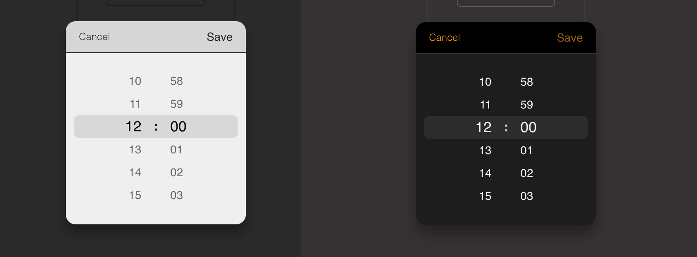
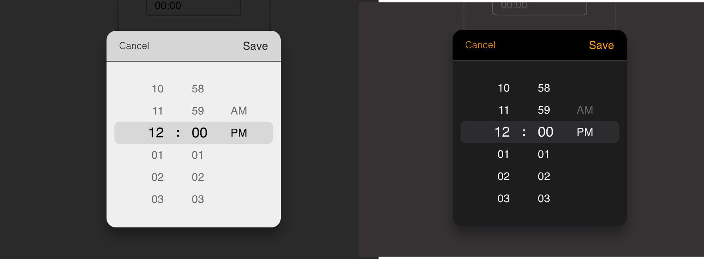

[](https://www.npmjs.com/package/react-wheel-time-picker) 

# React wheel time picker


>This package is inspired by an old javascript package (with a few bugs, probably due to the age of the package or incorrect implementation at the outset). [React ios time picker](https://github.com/MEddarhri/>react-wheel-time-picker)

A modern wheel time picker for your React app.

- Full Typescript support
- Dark & Light mode support
- No moment.js needed
- Zero dependencies and lightweight

## install

```
npm install react-wheel-time-picker
```
or 
```
yarn add react-wheel-time-picker
```

## Usage

### 24 hours format (light & dark)



```javascript
import React, { useState } from 'react';
import { TimePicker } from 'react-wheel-time-picker';

export default const  App = () => {
    const [value, setValue] = useState('12:00');
    const [isDarkMode, setIsDarkMode] = useState(false);

    const onChange = (timeValue: string) => {
    setValue(timeValue);
    };

   return (
      <div>
        <TimePicker
            label="Start time"
            isDarkMode={isDarkMode}
            onChange={onChange}
            value={value}
        />
      </div>
   );
}
```

### 12 hours format (light & dark)



```js
import React, { useState } from 'react';
import { TimePicker } from 'react-wheel-time-picker';

export default const  MyApp = () => {
    const [value, setValue] = useState('10:00 AM');
    const [isDarkMode, setIsDarkMode] = useState(false);

    const onChange = (timeValue) => {
        setValue(timeValue);
    }

   return (
      <div>
        <TimePicker
            use12Hours
            label="Start time"
            isDarkMode={isDarkMode}
            onChange={onChangehours}
            value={hourValue}
        />
      </div>
   );
}
```

## API

| Name               | Type                                          | Default        | Description                                                     |
| ------------------ | --------------------------------------------- | -------------- | --------------------------------------------------------------- |
| value              | String                                        | n/a            | Current value.                                                  |
| cellHeight         | Number                                        | 28             | The height of the cell number.                                  |
| placeHolder        | String                                        | `"Selet_time"` | Time input's placeholder.                                       |
| pickerDefaultValue | String                                        | `"00:00"`      | The initial value that the picker begin with in the first time. |
| disabled           | Boolean                                       | `false`        | Whether picker is disabled.                                     |
| isOpen             | Boolean                                       | `false`        | Whether the time picker should be opened.                       |
| required           | Boolean                                       | `false`        | Whether time input should be required.                          |
| cancelButtonText   | String                                        | `"Cancel"`     | Cancel button text content                                      |
| saveButtonText     | String                                        | `"Save"`       | Save button text content                                        |
| controllers        | Boolean                                       | `true`         | Whether the buttons should be displayed                         |
| seperator          | Boolean                                       | `true`         | whether show the colon seperator                                |
| id                 | String                                        | n/a            | Input time picker id                                            |
| name               | String                                        | n/a            | Input time picker name                                          |
| use12Hours         | Boolean                                       | false          | 12 hours display mode                                           |
| inputClassName     | String                                        | n/a            | Input time picker className                                     |
| popupClassName     | String                                        | n/a            | time picker popup className                                     |
| onChange           | `(value) => alert ('New time is: ', value)`   | n/a            | Called when select a different value                            |
| onSave             | `(value) => alert ('Time saved is: ', value)` | n/a            | When the user clicks on save button                             |
| onClose            | `() => alert('Clock closed')`                 | n/a            | When the user clicks on cancel button                           |
| onAmPmChange       | `(value) => alert('Am/Pm changed : value')`   | n/a            | called when select an am/pm value                               |
| onOpen             | `() => alert('time picker opened')`           | n/a            | called when time picker is opened                               |

## Contributions Welcome!

```shell
git clone https://github.com/rodolphe37/react-wheel-time-picker
```

## License

The MIT License.
